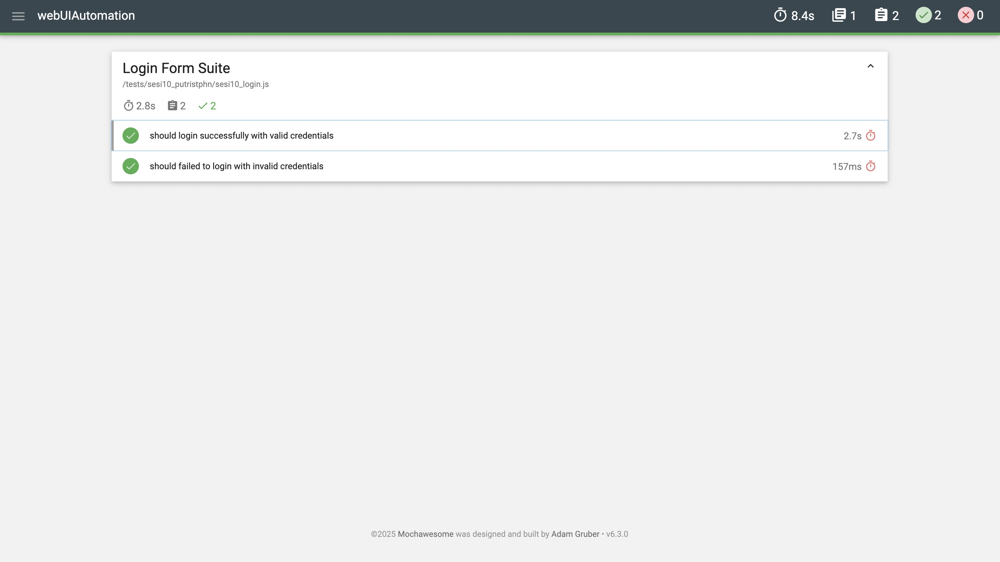
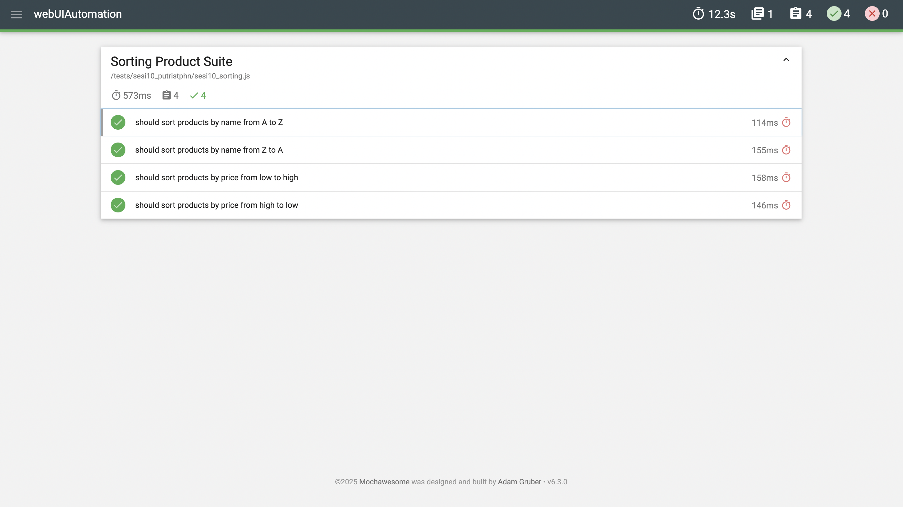
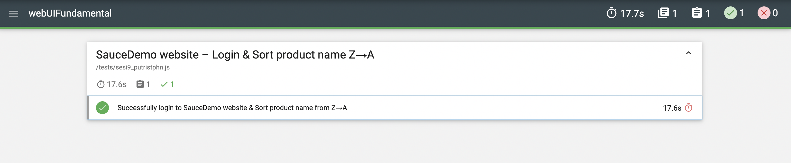

# 🧪 SauceDemo UI Automation Testing

Automated Web UI Testing project for [**SauceDemo Website**](https://www.saucedemo.com) using **Selenium WebDriver** and **Mocha**.  
Developed as part of the **Digital Skola QA Bootcamp Batch 12 - Session 9 (Web UI Automation Fundamental) & Session 10 (Web UI Automation Advance)** by **Putri Stephanie Lesilolo**.

---

## 📋 Project Overview

This project automates end-to-end UI tests for the SauceDemo website, focusing on:

- ✅ Login functionality validation (valid & invalid users)
- ✅ Product Sorting (Name Z→A / Price Low→High) 
- ✅ Page title and logo verification  
- ✅ Dropdown interaction and element visibility checks  
- ✅ Chrome browser options (e.g., Incognito mode to avoid password popups)
- ✅ Mochawesome HTML report generation

---

## 📁 Project Structure
```
webUIAutomation/
├── helper/
│    ├── helperlogin.js                       # Successful login flow (Session 10)
│    ├── helperloginfailed.js                 # Invalid login flow (Session 10)
│    └── helpersorting.js                     # Sorting dropdown helper (Session 10)
│  
├── tests/
│   ├── sesi9_putristphn.js                   # Login & Sorting test cases (Session 9)
│   └── sesi10_putristphn/
│       ├── sesi10_login.js                   # Login test cases (Session 10)
│       └── sesi10_sorting.js                 # Sorting test cases (Session 10)
│
├── assets/
│   ├── mochawesome-report-snapshot.png       # Snapshot of the Mochawesome report (Session 9)
│   ├── report-login.png                      # Snapshot of the Mochawesome report (Session 10)
│   └── report-sorting.png                    # Snapshot of the Mochawesome report (Session 10)
│
├── package.json                              # Project metadata & npm scripts
├── package-lock.json
├── README.md
└── mochawesome-report/                       # Auto-generated HTML reports
```

---

## ⚙️ Tech Stack

| Tool | Purpose |
|:------|:---------|
| **JavaScript (ES6)** | Test scripting language |
| **Selenium WebDriver** | Browser automation framework |
| **Mocha** | Test runner |
| **Mochawesome** | Test reporting |
| **Node.js + npm** | Runtime environment & package management |
| **ChromeDriver** | Web UI execution engine |

---

## 🚀 How to Run the Tests

### 1️⃣ Clone the repository
```bash
git clone https://github.com/putristphn/webUIAutomation.git
cd webUIAutomation
```
### 2️⃣ Install dependencies
```bash
npm install
```
### 3️⃣ Run specidic tests

| Command                 | Description                                |
| ----------------------- | ------------------------------------------ |
| `npm run testsesi9`     | Run Session 9 SauceDemo UI Fundamentals    |
| `npm run sesi10login`   | Run Session 10 Login (Positive & Negative) |
| `npm run sesi10sorting` | Run Session 10 Product Sorting Test        |

### 4️⃣ View the Mochawesome report
After the tests finish running, open:
```bash
open mochawesome-report/mochawesome.html
```

---

## 🖼️ Test Report Snapshot (Mochawesome)
Below is an example of the generated Mochawesome report after running the tests:

### Mochawesome report for Session 10 

| Login Suite                              | Sorting Suite                                |
| ---------------------------------------- | -------------------------------------------- |
|  |  |

### Mochawesome report for Session 9 
 

The report includes detailed logs, assertions, and pass/fail status for each test case.

---

## 🧠 Key Learning Points

- Setting up Selenium WebDriver with Node.js
- Handling elements using locators (`CSS`, `XPath`, `Class locators`)
- Using explicit waits (`until.elementLocated`, `until.urlContains`)
- Verifying UI elements instead of titles for headless runs
- Separating positive and negative login flows into dedicated helpers (`helperlogin.js`, `helpersorting.js`)
- Managing browser options (e.g., incognito mode)
- Ensuring test stability with consistent assertions on dynamic elements

---

## 💡 Example Test Case 

### 🧩 Login – Valid Credentials
Verifies redirection to the inventory page and the presence of the "Swag Labs" logo.
```javascript
await driver.wait(until.urlContains('/inventory.html'), 10000);
const appLogo = await driver.findElement(By.className('app_logo'));
const text = await appLogo.getText();
assert.strictEqual(text, 'Swag Labs');
```

### 🧩 Login – Invalid Credentials
Checks for an error banner with the phrase “locked out”.
```javascript
const errorEl = await driver.wait(
  until.elementLocated(By.css('[data-test="error"]')),
  10000,
  'Error message did not appear'
);
const text = await errorEl.getText();
assert.match(text, /locked out/i, 'Error message should contain "locked out"');
```

### 🧩 Sorting – Expected Order Validation
Uses known SauceDemo data to confirm proper sorting after dropdown selection.
```javascript
// Name (A → Z)
await driver.findElement(By.css('option[value="az"]')).click();
await driver.wait(until.urlContains('inventory'), 5000);
const firstAZ = await driver.findElement(By.css('.inventory_item_name')).getText();
assert.strictEqual(firstAZ, 'Sauce Labs Backpack');

// Name (Z → A)
await driver.findElement(By.css('option[value="za"]')).click();
await driver.wait(until.urlContains('inventory'), 5000);
const firstZA = await driver.findElement(By.css('.inventory_item_name')).getText();
assert.strictEqual(firstZA, 'Test.allTheThings() T-Shirt (Red)');

// Price (Low → High)
await driver.findElement(By.css('option[value="lohi"]')).click();
const firstLow = await driver.findElement(By.css('.inventory_item_price')).getText();
assert.strictEqual(firstLow.trim(), '$7.99');

// Price (High → Low)
await driver.findElement(By.css('option[value="hilo"]')).click();
const firstHigh = await driver.findElement(By.css('.inventory_item_price')).getText();
assert.strictEqual(firstHigh.trim(), '$49.99');
```
---

## 👩🏻‍💻 Author

**Putri Stephanie Lesilolo**  
*Quality Assurance Engineer*  
📍 Jakarta, Indonesia  

🔗 [LinkedIn](https://www.linkedin.com/in/putrilesilolo/) | [GitHub](https://github.com/putristphn)


